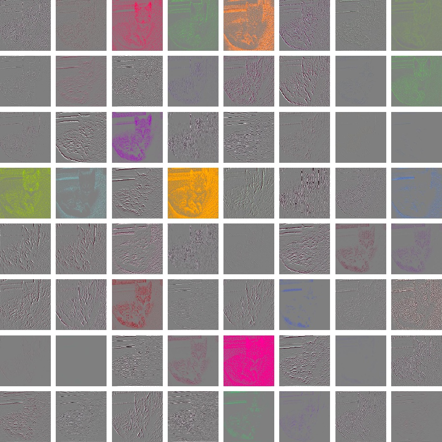

# CNN Activation Visualization

An implementation of the neural network visualization by Zeiler and Fergus using Chainer.

[Visualizing and Understanding Convolutional Networks, 2013](https://arxiv.org/abs/1311.2901)

## Prerequisites

- Install Chainer
- Download the Chainer VGG model


## Run

```bash
python visualize.py
```

Simply run the `visualize.py` script. The VGG model will be feeded with one of the sample images. Feature map activations for each of the five convolutional layers in the VGG model will be stored in the `activations/` sub-directorty.

## Sample Outputs

### First layer of convolutions



### Second layer of convolutions


### Third layer of convolutions


### Forth layer of convolutions


### Fifth layer of convolutions


## TODO

- [ ] Speed up indexed unpooling
- [ ] Support GPU
- [ ] Support Python 3.5
